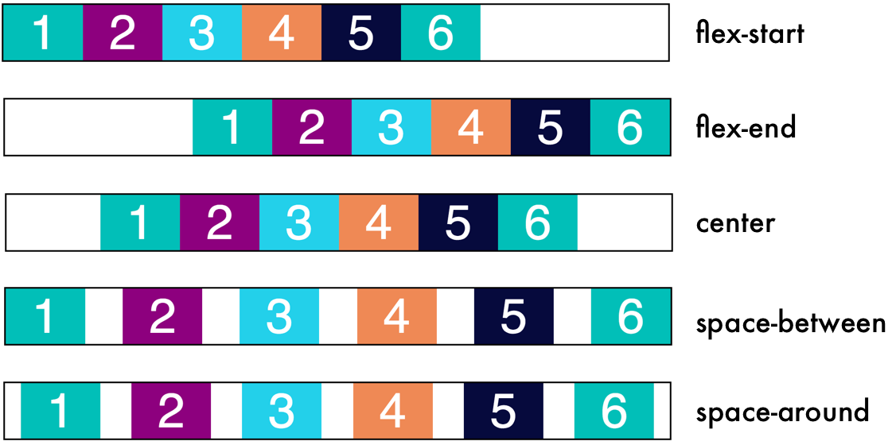

# CSS Flexbox

### According to [w3schools](https://www.w3schools.com/css/css3_flexbox.asp) :

* Before the Flexbox Layout module, there were four layout modes:

    *  Block, for sections in a webpage
    * Inline, for text
    * Table, for two-dimensional table data
    * Positioned, for explicit position of an element

* The Flexible Box Layout Module, makes it easier to design flexible responsive layout structure without using float or positioning

### About Flexbox

* Make sure you check your developer tools in each example to see the changes

* When working with flexbox always think about:

    * This is my container x

    * These are my child elements of that container x

    * With that in mind it will be easier to you to know where you should define elements on the parent or the children

#### flex-direction

* This image will help you understand how flexbox will align child elements for you with different flex-direction values

   [Image Resource](https://www.ostraining.com/blog/webdesign/css-flexbox-3-the-align-items-property/)

#### justify-content

* Its used on the parent element

* It aligns the children elements along the main-axis

* justify-content values can be:

   [Image Resource](https://openclassrooms.com/en/courses/5295881-create-web-page-layouts-with-css/5415181-align-items-and-justify-content)

#### align-items

* Its used on the parent element

* It aligns the children elements along the cross-axis

* align-items values are the same as justify-content but without space-between and space-around

* [Check here for more info](https://openclassrooms.com/en/courses/5295881-create-web-page-layouts-with-css/5415181-align-items-and-justify-content)

#### flex-wrap

* Its used on the parent element

   [Image Resource](https://cforcode.com/snippets/flexbox-basic-usage)

#### flex-shrink

* Its used on the child element

* The higher the number, the more it will shrink compared to the other items in the container

   [Image Resource](https://dzone.com/articles/detail-beginner-guide-for-css-flexbox-with-example)

#### flex-grow

* Its used on the child element

* It behaves opposite to flex-shrink

   [Image Resource](https://codeburst.io/flexbox-flex-basis-flex-grow-41b10bcd33a3?gi=2fc0b4e1b4f7)

#### flex-basis

* Its used on the child element

* It specifies the initial size of the element before CSS makes adjustments with flex-shrink or flex-grow

* You can give it the normal size units

#### order

* Its used on the child element

* You can customize the arrangement of the items

* It can take negative and positive number

#### align-self

* Its used on the child element

* It overrides the align-items property which is used on the parent